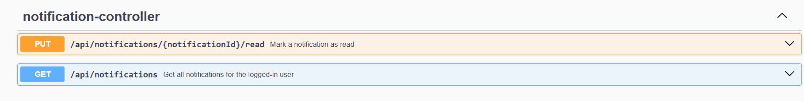
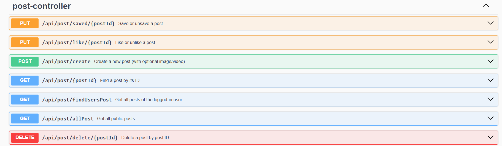
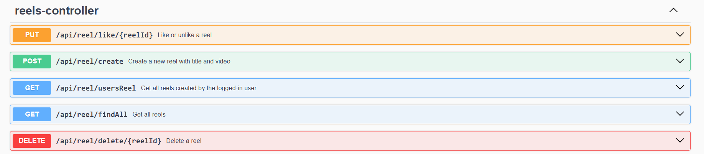
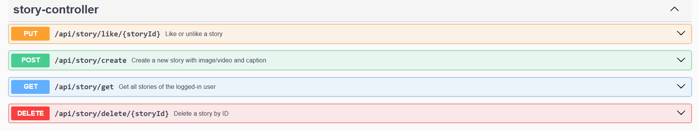
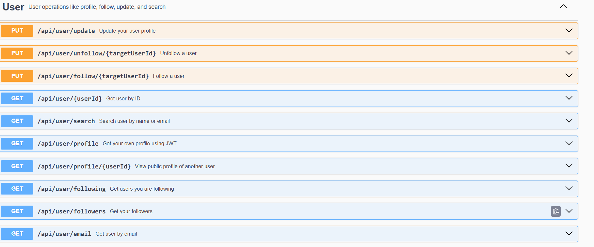

# 📱 Social Pie - A Complete Social Media Backend


social-pie is a backend system for a social media platform, built using Java and Spring Boot, that mimics the core functionalities of modern social apps like Instagram. The project is structured with clean code practices, DTO usage, exception handling, layered architecture (Controller → Service → Repository), and uses JWT for secure authentication.

It provides features like user management, post creation and interaction, reels (short video sharing), stories, commenting system, chat and messaging, and a notification system. It supports follower/following relationships, profile viewing , and Cloudinary integration for media uploads.

All functionalities are exposed via REST APIs, fully tested using Postman, and documented using Swagger/OpenAPI. The project also includes modular utilities and DTO mappers to prevent overexposing internal data.

---

## 🚀 Live Features

### 🔐 Authentication
- JWT-based login and registration

### 🧑‍🤝‍🧑 User System
- Follow / Unfollow users
- View own and others' profiles

### 📝 Posts
- Create, delete, like/unlike, and save/unsave posts
- View personal and public posts

### 💬 Comments
- Add comments to posts
- Like comments

### 📽️ Reels
- Upload and delete short video reels
- view all reels
- Like/unlike reels

### 📚 Stories
- Upload image/video stories
- Scheduled task for cleanup of expired stories
- Like/unlike and delete stories

### 💬 Chat System
- One-to-one real-time chats
- image support in chats

### 📩 Messages
- Send text and image messages in chats

### 🔔 Notifications
- Types: LIKE_Post, LIKE_Reel, MESSAGE, etc.
- Mark as read / Get all notifications

### 🔍 Search
- Search users by name or email

### ☁️ Cloudinary Integration
- Secure cloud storage for images/videos


## 📂 Project Structure

```bash
├── config/              # Configuration classes (e.g., security, jwt authentication etc)
├── controller/          # REST controllers 
├── dto/                 # Data Transfer Objects – used for API response payloads
├── entity/              # JPA Entities – maps database tables to Java classes
├── exception/           # Custom exceptions, global exception handlers (e.g., @ControllerAdvice)
├── repository/          # Spring Data JPA repositories – interfaces for database operations
├── request/             # Specific request models
├── response/            # Specific response models 
├── service/             # Service interfaces – business logic layer
│   └── impl/            # Implementations of service interfaces
├── utility/             # Utility classes – mappers for dto
├── resources/           # Static resources, application.properties, templates, etc.
└── Application.java     # Main Spring Boot application class
```


## 💻 Tech Stack

| Layer           | Technology / Approach         |
|------------------|-------------------------------|
| Language         | Java 21                       |
| Framework        | Spring Boot 3                 |
| Architecture     | RESTful API                   |
| Security         | Spring Security + JWT         |
| ORM              | Spring Data JPA (Hibernate)   |
| Database         | MySQL                         |
| Cloud Storage    | Cloudinary                    |
| API Documentation| Swagger (Springdoc OpenAPI)   |
| API Testing      | Postman                       |
| Build Tool       | Maven                         |


## 📦 Installation (Local Setup)

### Clone the Repository
```bash
git clone https://github.com/RAUSHAN0307/social-pie.git
cd social-pie
```
### Configure MySQL Database

1. **Create a database** named `social_pie` in your MySQL server.

2. **Update your database credentials** in the `src/main/resources/application.properties` file:

```properties
spring.jpa.hibernate.ddl-auto=update
spring.datasource.url=jdbc:mysql://localhost:3306/your_database_name
spring.datasource.username=your_username
spring.datasource.password=you_password
spring.datasource.driver-class-name=com.mysql.cj.jdbc.Driver
spring.jpa.show-sql = true
spring.jpa.properties.hibernate.dialect=org.hibernate.dialect.MySQL8Dialect
```
### Cloudinary Setup

1. **Sign up** for a [Cloudinary](https://cloudinary.com/) account if you don't have one.

2. **Add your Cloudinary credentials** to the `src/main/resources/application.properties` file:

```properties
cloudinary.cloud_name=your_cloud_name
cloudinary.api_key=your_api_key
cloudinary.api_secret=your_api_secret
```


### Run the Application

Run the Spring Boot application using the Maven wrapper:

```bash
./mvnw spring-boot:run
```

<details>
<summary><b>🔐 Auth Controller</b></summary>


</details>

<details>
<summary><b>💬 Chat API</b></summary>



</details>

<details>
<summary><b>📝 Comment API</b></summary>


</details>

<details>
<summary><b>✉️ Message API</b></summary>


</details>

<details>
<summary><b>🔔 Notification API</b></summary>


</details>

<details>
<summary><b>📰 Post API</b></summary>



</details>

<details>
<summary><b>🎞️ Reels API</b></summary>



</details>

<details>
<summary><b>📚 Story API</b></summary>



</details>

<details>
<summary><b>👤 User API</b></summary>



</details>


## 📘 Future Enhancements

Here are some planned improvements and features under active or future development:

- ✅ **Real-Time Chat** using WebSocket / STOMP  
  Implementing bi-directional messaging between users for seamless chat experience.

- ✅ **Real-Time Notifications**  
  Instant notification delivery for likes, comments, messages, and follows using WebSocket.

- ✅ **Role-Based Access Control (Admin/User)**  
  Secure and restrict access to admin-only features and user-specific operations.

- ✅ **Email Notifications**  
  Sending confirmation emails, password recovery links, and activity alerts via SMTP or third-party email APIs.

- 🌐 **Frontend in React (in progress)**  
  A modern, responsive React frontend to complement the Spring Boot backend.

- 🛡️ **OAuth 2.0 Login Support**  
  Support for Google, GitHub, and other OAuth2 providers for quick registration/login.

- 📄 **Pagination for Large Datasets**  
  Efficient API responses for posts, comments, reels, followers, etc., using Spring Data JPA's pagination support.


## 📧 Author

**Raushan Kumar Jha**  
📫 Email: jharaushan2002@gmail.com  
💻 Aspiring Java Backend Developer | Passionate about building real-world Spring Boot applications

---

## 🔖 Topics / Tags

`#SpringBoot` `#SocialMediaApp` `#Java` `#BackendDevelopment` `#JWT` `#Cloudinary` `#MySQL` `#Swagger`


